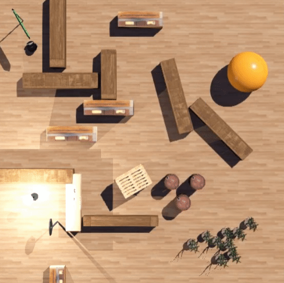
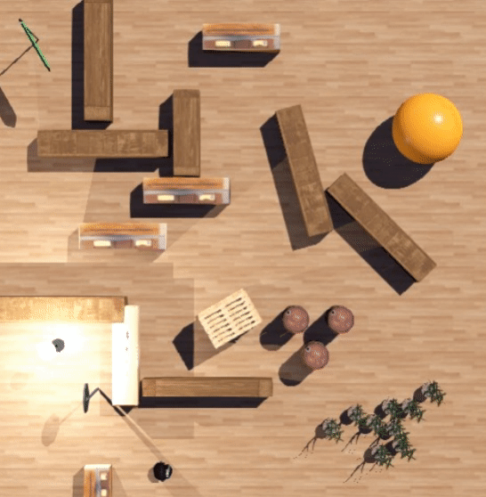

<h1 align="center">PIONEER 3-DX- CHALLENGE</h1>

 This repository has a solution for the Pioneer 3-DX Robot to find an illuminated region in an area on the Webots software. 

In this challenge, the  Pioneer 3-DX robot has as the main objective to achieve region illuminated that is on the map under 2 minutes of simulation. To obtain the desired result 2 light sensor were implemented with the goal to measure the luminosity of the near from the robot.
The sensors were implemented in the front of the robot, one on the left side and another on the right. When the robot is very close to the illuminated area,  with these sensors, a very simple trajectory control was designed to get in the direction of the light source

Beyond the light sensors, the Pioneer 3-DX also contains 16 distance sensors that collect data to being used on avoiding obstacles task. From the original code aimed at the task of avoiding, few minor changes were implemented to optimize.

 The capacity to avoid obstacles with the detection of luminosity are the two factors that helped achieve the goal of the challenge in less than 2 minutes. There is a video on the /folder desafiorobotica-webots-2021/video that shows the task being completed in less than 41 seconds. The first gif below shows the robot avoiding an obstacle and the second one shows the robot achieving the goal.  

<h1 align="center">
  
</h1>

<h1 align="center">
  
</h1>

# For clone this repository
$ git clone git@github.com:matheusanselmo19/Pioneer-3-DX-challenge.git

